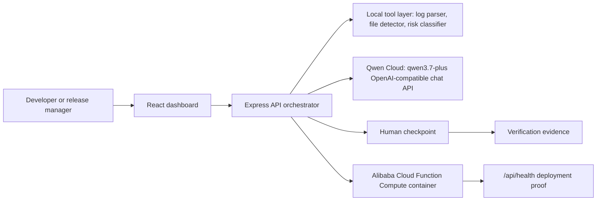

# Architecture

Qwen CI Autopilot is a small production-style agent system:

## Runtime Flow

1. The frontend sends a scenario and optional custom CI signal to
   `POST /api/autopilot/run`.
2. The backend extracts deterministic local evidence before model calls:
   candidate files, commands, errors, constraints, and risk signals.
3. If `DASHSCOPE_API_KEY` is configured, the orchestrator calls Qwen Cloud once
   per agent stage and asks for structured JSON.
4. If Qwen Cloud is unavailable, the orchestrator returns a deterministic demo
   result while preserving the same response contract.
5. High-risk signals create an `approval_required` checkpoint before the
   verification stage is released.
6. The UI renders generated artifacts, commands, model route, and Alibaba
   deployment proof.

## Agent Stages

- Signal Triage Agent: classifies failure surface and ambiguity.
- Reproducer Agent: chooses the minimum commands and evidence capture.
- Patch Planner Agent: proposes a scoped patch intent.
- Risk Review Agent: decides whether human approval is mandatory.
- Verification Agent: lists test, build, and deployment proof commands.

## Failure Handling

The Qwen path is deliberately wrapped with a deterministic fallback so the demo
is still usable during key, quota, or network issues. The UI labels the route as
`Live Qwen Cloud`, `Qwen fallback`, or `Demo fallback`.
